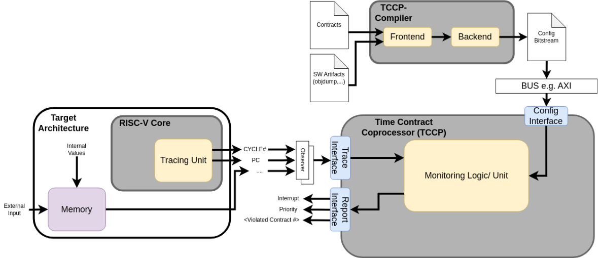

# Timing_contracts_coprocessor (TCCP) in [ISOLDE](https://www.isolde-project.eu)

## Project Introduction
ISOLDE is a KDT-JU-funded project with a duration of three years starting on May 1st 2023. The goal of the ISOLDE project is to create, expand, and industrialize a European high-performance RISC-V open-source ecosystem to reduce dependence on non-EU technology suppliers and to strengthen competitive domestic microelectronics production. The targeted application area of ISOLDE is embedded systems that require significant computing power due to future functional requirements, while still being able to be part of safety-critical systems. Therefore, support for safety and security technologies is also part of the objectives.

## The Time Contract Coprocessor (TCCP)
The TCCP serves as a modular and composable time contract monitoring co-processor. The monitoring approach builds upon previous work from the VE-VIDES project[1], a German-funded initiative, and extends earlier research[2] conducted in EU-funded projects such as Productive4.0.

This co-processor is designed to support a formal Contract-Based Design (CBD) language [3]. It handles fundamental timing properties, including aging, event occurrence, and reaction. Additionally, it facilitates the monitoring of non-temporal properties, such as power consumption or ensuring that a specific controller maintains a parameter within a defined range over a given time frame. The monitoring of these multiple properties can be performed simultaneously. Examples include running closed-loop motor control in parallel with a computationally intensive task or verifying that a complex AI algorithm consistently completes its execution within a specified period.

Implemented are the following contract types:

| Monitor Type ID | Monitor Type                                      | Monitor ID | Observer ID | Event/ Val a | Event/ Val b | ValInt Start | ValInt Stop |
|-----------------|---------------------------------------------------|------------|------------|--------------|--------------|--------------|-------------|
| 0               | Periodic event a occurs every [X, Y]           | ID         | ID         | a            | /            | X            | Y           |
| 1               | Reaction Whenever a occurs then b occurs within [X, Y] | ID         | ID         | a            | b            | X            | Y           |
| 2               | Aging Whenever a occurs then b has occurred [X,Y] before | ID         | ID         | a            | b            | X            | Y           |
| 3               | Value d is within [X,Y] at timepoint [a, b]       | ID         | ID         | a            | b            | X            | Y           |
| 4               | Value d is within [X,Y] from location/ PC a until b | ID         | ID         | a            | b            | X            | Y           |

In the event of an input pattern in the form of "a;a;b" for Monitor Type 2. the 2nd "a" would be ignored.

As shown in the following figure, the contract-based runtime monitoring approach consists of three interacting components:
At its core, the Time Contract Co-Processor (TCCP) connects to two other components, the TCCP-Compiler and the observer interfaces. 
The TCCP executes contract-based specifications in hardware and observes various event sources via an observer interface. The observers are minimalistic adapters to source data, like a RISC-V trace port to observe computational progress or a memory content observer. The TCCP monitors events according to its programmable configuration derived from contract specifications. These specifications are processed by the TCCP compiler, which generates a configuration program for the TCCP.

## Simulation
The [SystemC](SystemC/README.md) and [SystemVerilog](SystemVerilog/README.md) simulations are described and explained in their own READMEs.

## Testbench
The TCCP IP is tested by exemplary output through the interfaces tip (Trace Ingress Port) and iti (Instruction Trace Interface), developed by SYSGO and an exemplary output of a brightness sensor. Iti is the further developed and renamed version of the tip, both are compliant to the Efficient Trace for RISC-V standard Version 2.0.2(https://github.com/riscv-non-isa/riscv-trace-spec/releases/download/v2.0.2/riscv-trace-spec-asciidoc.pdf), specifically:
- Chapter 4.1: Instruction Trace Interface Requirements

- Chapter 4.2: Instruction Trace Interface

See also [git commit in cva6 repo](https://github.com/openhwgroup/cva6/commit/f314dcb136ed373db8332e30a897fa06db4aae43).

Since the TCCP is capable of observing and monitoring multiple domains and interfaces at the same time, the testbench is built to evaluate multiple different scenarios:  (1) each interface on its own, with the other deactivated (2) a combination of the interfaces 

## OFFIS in ISOLDE
In this context, OFFIS cooperates with 38 other European partners and contributes to the safety and security part of the ISOLDE project. OFFIS develops an open-source, generic, and configurable contract-based timing monitoring co-processor. This co-processor monitors the safety/security related system behaviours at runtime, to guarantee the correct execution of these behaviours. Furthermore, OFFIS provides a compiler for initialization of the co-processor and configuration of the monitoring specifications. Finally, the results will be integrated with the other partners‘ components and presented in an automotive demonstrator.

https://www.offis.de/en/offis/project/isolde.html

##  Acknowledgement
This activity has received funding from the Key Digital Technologies Joint Undertaking (KDT JU) under grant agreement No 877056. The JU receives support from the European Union’s Horizon 2020 research and innovation programme and Spain, Italy, Austria, Germany, Finland, Switzerland.

## License
OFFIS e.V. licenses this file
to you under the [Apache License, Version 2.0](LICENSE) (the
"License"); you may not use this file except in compliance
with the License.  ou may obtain a copy of the License at

http://www.apache.org/licenses/LICENSE-2.0

Unless required by applicable law or agreed to in writing,
software distributed under the License is distributed on an
"AS IS" BASIS, WITHOUT WARRANTIES OR CONDITIONS OF ANY
KIND, either express or implied.  See the License for the
specific language governing permissions and limitations
under the License.   
## References 
- [1]: Elektronik- und Mikrosysteme VDI/VDE Innovation + Technik GmbH. VE-VIDES Project.
https://www.elektronikforschung.de/projekte/ve-vides, 2024. Accessed: 2025-03-31.
- [2]:  Duc Do Tran, Kim Grüttner, Frank Oppenheimer, and Wolfgang Nebel. Timing Contracts and Monitors for Safety Relevant Controller Design in IEC 61499. In 2020 25th IEEE International Conference on Emerging Technologies and Factory Automation (ETFA), volume 1, pages
156–163, 2020.
- [3]: Alberto Sangiovanni-Vincentelli, Werner Damm, and Roberto Passerone. Taming Dr.
Frankenstein: Contract-Based Design for Cyber-Physical Systems. European Journal of
Control, 18(3):217–238, 2012.