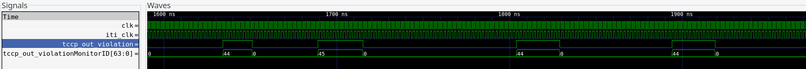
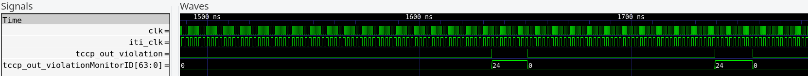
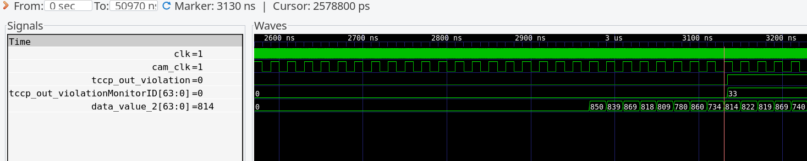
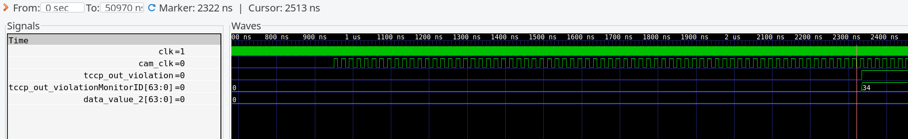
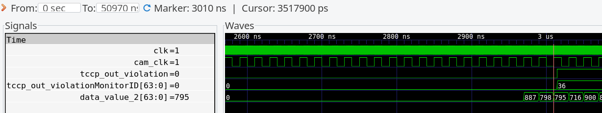

# SystemC Simulation - Timing Contracts Coprocessor

## Running simulation

```sh
git clone https://github.com/offis/isolde-tccp
cd isolde-tccp
git submodule update --init --recursive
cd SystemC
make
```

## Testbench
The TCCP clock starts after 120 ns, with a new cycle every  ns and therefore a frequency of 1 GHz and a pulse length of 0.5 ns.
```cpp
sc_clock tccp_clk{"clk", 1, SC_NS, 0.5, 120, SC_NS, false};
```
The clock to fill the DP RAM with the contracts starts after 10 ns, with a new cycle every ns and therefore a frequency of 1 GHz and a pulse length of 0.5 ns.
```cpp
sc_clock dp_ram_clk{"dp_ram_clk", 1, SC_NS, 0.5, 10, SC_NS, false};
```
In the testbench configuration the TCCP is connected to three observers and consists of monitors for up to 100 contracts. The Fifos inside the TCCP are able to buffer up to 10 events.

### Testbench Contracts
In the constructor of [tb_fill_ram.h](tb_fill_ram.h) you can find the exemplary contracts pushed to the DP-RAM.
```cpp
{1, 0, 0, 1, 10, , 1000, 2000}
```
Would translate to:
Contract should be initialized, Contract_id 0, contract_type 0, Observer_id 1(TIP), Event_Val_a 10, Event_Val_b 20, Val_Interval_Start 1000, Val_Interval_Start 2000
Where the timing is measured in TCCP cycles. Meaning, this contract "0" would monitor the periodic occurence of the PC 10. A new event with the specific PC value should be arriving 1000 to 2000 TCCP-clk cycles after the last one.

In the following table you find the contracts from the mentioned in [tb_fill_ram.h](tb_fill_ram.h). The contracts for observer 1 are explained in section iti, the ones with observer id 2 are explained in section tip and section Camera for id 3. The leading ones are remove.

| ID  | Monitor | Observer | Event/ Val a      | Event/ Val b      | ValInt Start | ValInt Stop  | Note |
|:---:|:-------:|:--------:|:-----------------:|:-----------------:|:------------:|:------------:|:------------:|
| 4   | 1       | 1 (TIP)        | 2147483648        | 2147483676        | 10           | 20           ||
| 5   | 1       | 1 (TIP)        | 2147483648        | 2147483676        | 6            | 30           ||
| 24   | 2       | 0 (ITI)       | 0x80000030        | 0x80000018        | 4            | 12           ||
| 32  | 3       | 2 (CAM)       | 3000        | 3100        | 1           | 1023           ||
| 33  | 3       | 2 (CAM)         | 3000        | 3100        | 2000            | 4025            |violation|
| 34  | 3       | 2 (CAM)         | 2200        | 2400        | 1          | 1023            |violation |
| 35  | 4       | 2 (CAM)         | 1        | 14        | 700         | 900            |violation |
| 36  | 4       | 2 (CAM)         | 1        | 14        | 800          | 900            |violation |
| 44  | 1       | 0 (ITI)        | 0x80000028        | 0x80000030        | 4           | 16            ||
| 45  | 0       | 0 (ITI)        | 0x80000018        | 0                 | 5           | 35           ||

The ID is referring to the contract/ monitor ID, Monitor refers to the monitor type, Event/ Val a+b refer to the 

### Scenario
You can switch between the scenarios with activating and deactivating the testbench in the main.cpp at two points.
For example:
```cpp
Tb_iti<true> *tb_iti;
Tb_tip<false> *tb_tip;
Tb_cam<false> *tb_cam;
```
and
```cpp
tb_iti = new Tb_iti<true>("tb_iti");
tb_tip = new Tb_tip<false>("tb_tip");
tb_cam = new Tb_cam<true>("tb_cam");
```

**What you should observe:**

- Signal `clk` starts pulsing at 120ns.
- Signal `cfetch_out_active` rises at around 220ns, signaling the end of fetching the contracts from the DP-RAM into the watchdogs.
- Signal `demux_out_rdy` should toggle every 16 `clk`-cycles regulary after 120ns until the `iti_clk` starts pulsing.
- Signal `iti_clk`starts pulsing at 950ns.
- The first value from the iti testbench is spawned shortly before 1500ns. That's visible through a first toggle from the signal `tb_iti_new_val`.

### Iti

The Itit trace is
For the iti test the [.dasm file](TestInput/ITI-test/trace_hart_0.dasm) and [iti.trace file](TestInput/ITI-test/iti.trace) are created here [SvenMehlhop/iti-test](https://github.com/SvenMehlhop/iti-test), forked from [dassheladiya/tip-test](https://github.com/dassheladiya/tip-test). 

The iti clock starts after 950 ns, with a new cycle every 2 ns and therefore a frequency of 500 MHz and a pulse length of 2 x 0.5 ns.
```cpp
sc_clock iti_clk{"iti_clk", 2, SC_NS, 0.5, 950, SC_NS, true};
```
Testbench input is the [.dasm file](../TestInput/ITI-test/trace_hart_0.dasm) and the [iti.trace file](../TestInput/ITI-test/iti.trace). The dasm file is used to create a somehow realistic time-wise sequence. For each instruction, one cycle passes, until the PC of an instructon matches with one of the iti-trace. The iti-trace functions as the real stimuli for the iti observer. 

Based on the contracts #44 and #45, we monitor the execution time between PC-value `0x8000000c` and `0x80000030` (#44), and the periodic occurences of PC-value `0x8000000c`(#45). You should see some violations of both only in the beginning.



Activating only contract #24 with the iti observer id, you should see some violations, but only in the beginning




### TIP
The Tip clock starts after 950 ns, with a new cycle every 2 ns and therefore a frequency of 500 MHz and a pulse length of 2 x 0.2 ns.
```cpp
sc_clock tip_clk{"tip_clk", 2, SC_NS, 0.2, 950, SC_NS, false};
```

The tip input is based on an testbench run on CVA6 with the TIP interface. The file can be found here: [tip-input](TestInput/tip-test/tip_port_0_signals_dump.txt).


### Camera
The camera clock starts after 950 ns, with a new cycle every 10 ns and therefore a frequency of 50 MHz and a pulse length of 2 ns.
```cpp
    sc_clock cam_clk{"cam_clk", 20, SC_NS, 0.1, 950, SC_NS, true};
```
The camera test bench emulates a brightness sensor observing the capture of a driver in an automotive use case. It is based on a sensor with a digital reprentation of lux values ranging between 0 and 1023. The emulated behavior consists of a wake-up and initialization phase during which the sensor output is 0.
After initialization, the scenario involves the camera regularly taking pictures, which then need to be analyzed. While taking a picture, the brightness should be within a certain range to fulfill requirements for driver safety and the quality of subsequent computations.
Monitors 32, 33, 34, 35, and 36 showcase the use of TSBC contracts and monitor types 3 and 4. Monitors 32-34 are aimed at the time point after the sensor's setup phase. Monitor 32 adheres to regular behavior. After 3000 cycles, the sensor should be operational and output values between 1 and 1023. 
Monitor 33 showcases an error in the values. The sensor output is always lower than 1023, so the monitor for the contract indicating a value range between 2000 and 4025 should detect a violation.


Monitor 34 is displaying an error in the timeframe. The test bench outputs a 0 until around 3000 cycles; therefore, the contract is violated since the value is 0 between cycles 2200 and 2400.


Monitor 35 is also demonstrating typical behavior. Here, the timing is based on the current PC value. The testbench generates values between 700 and 900 between PCs 1 and 14, and then values between 1 and 900 afterwards.
Monitor 36's contract requires that the value stay between 800 and 900 during the camera's on phase. Since the test bench generates values between 700 and 900 for that phase, there is a possibility of a violation.
