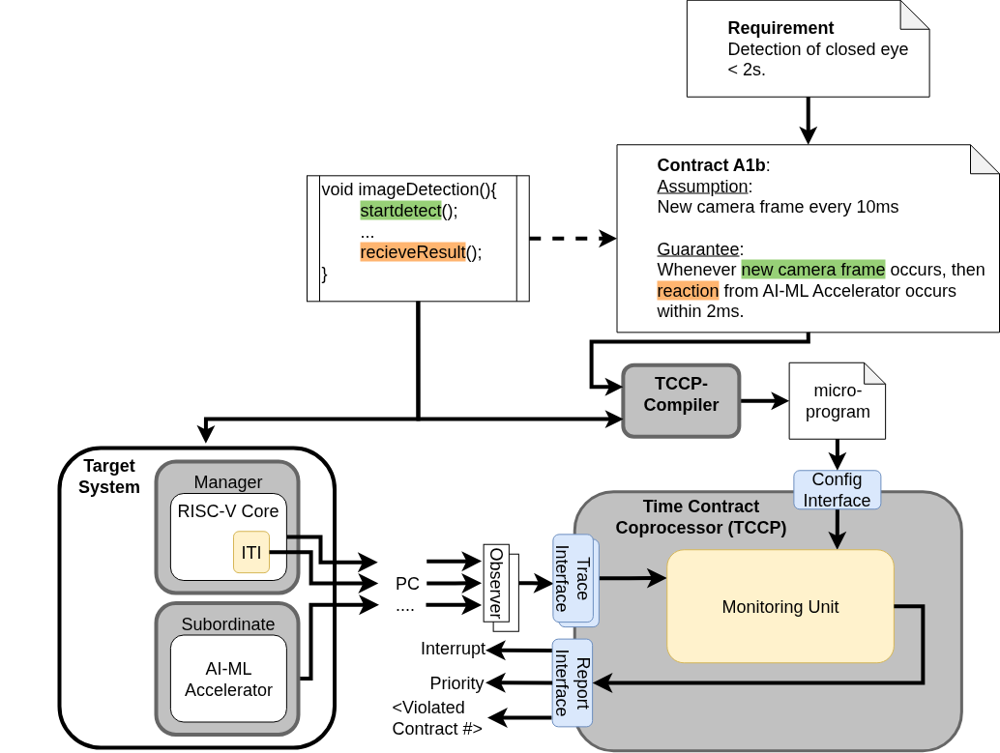

# Time Contract Co-processor Compiler(TCCP-CO)
The TCCP-CO is a compiler that compiles timing contract files and software artifacts into instructions for the TCCP co-processor. This compiler provides the ability to initialize the timing monitor coprocessor and configure the specifications of the monitors during SW updates. The compiler consists of a frontend and a backend. 

The compiler gathers information from contract specifications and SW artifacts such as objdump-files as well as the clock-rate from the TCCP. This information is combined, so that a label of an instruction is connected to a program counter of the specific instruction. Also, the timing values of the contracts need to be converted into a clock cycle count via the clock rate. Afterwards, this information is transformed into the microcode and transmitted to a DP-RAM, which content gets fetched into the monitoring logic in the TCCP initialization phase.


 
 ## Inputs
- Global configuration example (`config.toml` in the compiler root):
```toml
[main]
input="Input"     # Input directory containing the project folders
output="Output"   # Output directory for the compiled results
```

- Project-specific configuration (`Input/<project_name>/config.toml`):
```toml
[main]
contract = "contracts.txt"  # Relative path to the contract DSL file (or array of files)
output = "testMinimal"      # Output subfolder name
freq = "150MHz"             # Clock frequency of the TCCP (supports Hz, kHz, MHz, GHz)

[[observer]]
id = 0
name = "ITI"

[[observer]]
id = 1
name = "TIP"
# Supports scoped label resolution via object dump:
sources = [
    { contract = "tip_contract.s", dump = "tip_port_0.dump" }
]
```

- Contracts definition (`contracts.txt` or `.s` / `.asm` files):
The compiler supports a simple domain-specific language (DSL). In assembly/source files, contracts should be enclosed in a `CONTRACT("...")` macro.
Templates:
```text
// Type 0: Periodic Event
Event <PC_or_label> occurs every <min_time>, <max_time> at observer <observer_name>

// Type 1: Reaction
Whenever <PC_or_label_a> occurs then <PC_or_label_b> occurs within <min_time>, <max_time> at observer <observer_name>

// Type 2: Aging
Whenever <PC_or_label_a> occurs then <PC_or_label_b> has occurred <min_time>, <max_time> before at observer <observer_name>

// Type 3: Time-Scoped Boundary Constraint (TSBC)
Value is within <min_val>, <max_val> at timepoint <min_time>, <max_time> at observer <observer_name>

// Type 4: PC-Scoped Boundary Constraint (TSBC PC)
Value is within <min_val>, <max_val> from PC <PC_or_label_a> until <PC_or_label_b> at observer <observer_name>
```
*Note: Time values can be specified with units (`s`, `ms`, `us`, `ns`, `ps`). Commas are required to separate range bounds.*
*Note: to test e.g. the iti_tccp_label_test one needs to ensure the existence of the ./ITI-test/iti_tccp_label_test-bin.dump file which is generated by a build process.*

Example:
```text
// Periodic check for instruction progress
Event 0x80000018 occurs every 5ns, 20ns at observer ITI

// Check reaction time between two retired program counters
Whenever 0x80000028 occurs then 0x80000030 occurs within 4ns, 16ns at observer ITI
```

#### Example for Assembly Files (`.s` / `.S` / `.asm`):
To embed contracts directly into assembly files, define `CONTRACT` and `EVENT` macros that resolve to nothing/labels respectively. The contracts are defined at the top, and their reference points are marked with the `EVENT` macro in the code. The TCCP-CO compiler will extract the contract strings and resolve the event names to program counter values using the corresponding `.dump` file:

```assembly
#define CONTRACT(str)
#define EVENT(name) name:

CONTRACT("Event A occurs every 10ms, 20ms at observer platon_hw")
CONTRACT("Whenever A occurs then B occurs within 0ms, 3ms at observer platon_hw")
CONTRACT("Whenever A occurs then B has occurred 0ms, 5ms before at observer platon_hw")
CONTRACT("Value is within 0, 30 from PC A until B at observer platon_hw")

_start:
    li t0, 5
    li t1, 10
    li t2, 20
    li t3, 15
    li t4, 30

    beq t0, t1, block_1   # if (t0 == t1) goto block_1
    beq t0, t1, block_1   # if (t0 == t1) goto block_1
    bne t0, t1, block_2   # if (t0 != t1) goto block_2

block_1:
    EVENT(B)
    blt t0, t2, block_3   # if (t0 < t2) goto block_3
    bge t0, t2, _start    # if (t0 >= t2) goto _start
    

block_2:
    EVENT(A)
    add t0,t0,1
    beq t0,t4, block_1
    jal block_3          #

block_3:
    
    blt t0, t1, block_2  # if (t0 < t1) goto block_2
    j _start             # 
```
During compilation, TCCP-CO parses the assembly file, extracts all contract strings inside `CONTRACT("...")`, and resolves the event names (`A`, `B`) to their target PC values by matching them with the generated symbols from the `.dump` file.


 ## Outputs
 - `contracts.csv`: Compiled binary representation of contracts for loading into TCCP DP-RAM.
 Example: 
 ```csv
 # id, type, obs_id, val_a, val_b, val_interval_start, val_interval_stop
 4, 1, 1, 2147483648, 2147483676, 10, 20
 5, 1, 1, 2147483648, 2147483676, 6, 30
 ```
 - `summary.md`: A human-readable markdown file summarizing the compiled contracts.

 ## Usage

### 1. Build the Compiler
Run `make` in the `TCCP-CO` directory:
```sh
make
```

### 2. Run the Compiler
To compile a specific project configuration located in the input folder:
```sh
./build/tccp_co <project_name> [--debug]
```

### 3. Run Predefined Tests
The Makefile contains shortcuts to compile and run specific projects:
```sh
make testMinimal      # Runs the minimal test suite
make testLabel        # Runs tests that resolve labels using object dumps
make testFDL          # Runs the FDL AMR demonstrator compilation
```
